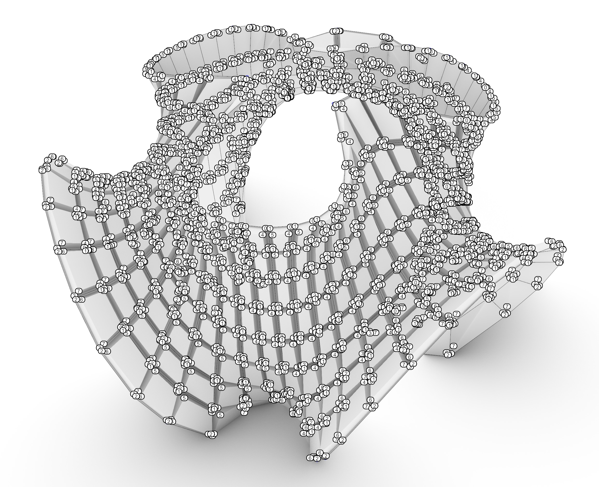

# Structural Design: Assignment 2

> submitted by Gene Ting-Chun Kao (kao@arch.ethz.ch)

## KnitCandela: Formwork for concrete ribs

* solution: [blocks.py](blocks.py) 
* input: [cablenet.json](cablenet.json)
* output: [blocks.json](blocks.json)

The mesh surface defined in `cablenet.json` represents the bottom layer of the flexible formwork. On top of that there will be concrete ribs along the edges of the mesh and finally a continuous concrete surface that forms the outer shell.

> Generate `cablenet.json` from `knitcandela.fofin` using `FOFIN_to`, which serializes the cablenet data structure to a JSON file.

The task of this part of te assignment is to generate the formwork for the ribs. The formworks consists of a foam block per face of the mesh that is slightly smaller than the face. This creates a grid of spaces in between the volumes of the blocks in which concrete can be sprayed to create the concrete rib structure.

The blocks should be slighty tapered. Therefore, you will have to offset not only the bottom polygon to create the gap for the ribs, but also the polygon on the top to create the tapering.

Each block volume should be created as an individual mesh. The meshes have to be visualised in Rhino and the list of meshes serialised to a JSON file.

Result

## Texas Shell: Boundary structure

* template: no template (start from scratch)
* input: `cablenet.json` (to be generated)

The mesh surface defined in `cablenet.json` represents the bottom layer of the flexible formwork. On top of that a layer of concrete will be applied that will form the shell.

> Generate `cablenet.json` from `texas.fofin` using `FOFIN_to`, which serializes the cablenet data structure to a JSON file.

The task of this part of the assignment is to generate the boundary structure that supports the cablenet. The boundary structure should be composed of simple, straight wooden beams. Therefore, the boundary has to be discretised into segments that fit into reasonably sized wooden planks.

The boundary structure should be placed at least 0.2m away from the boundary of the shell structure. The connection points for the cables should lie along the direction of the reaction forces.

Finally, the beams should be sized such that the cables go through the front and back face of the beam only, not through the faces on top and bottom.
