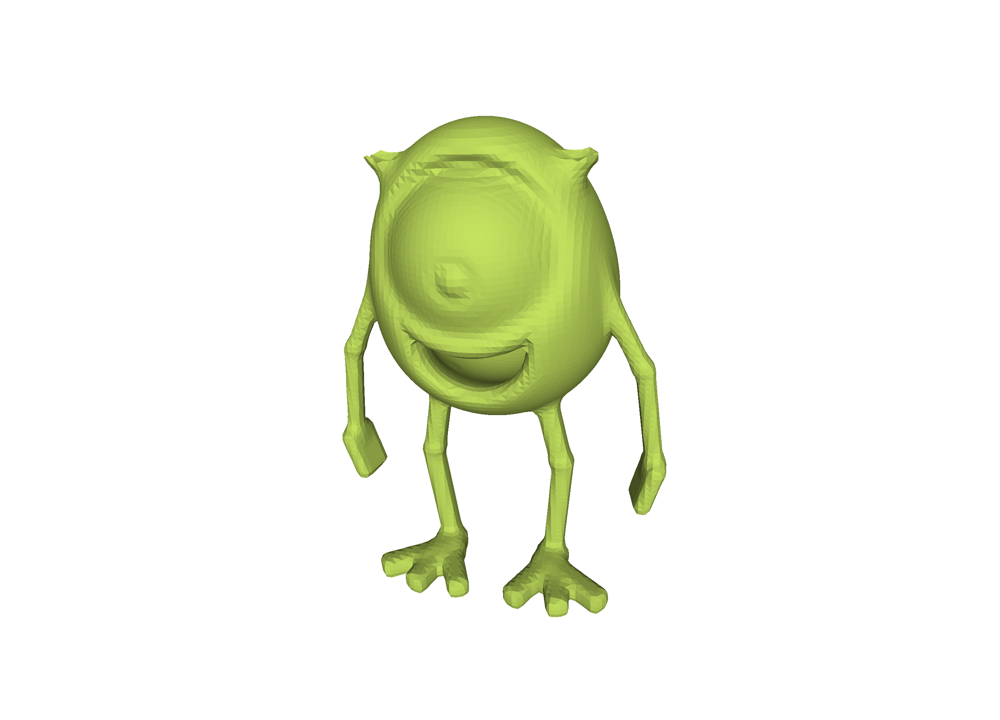
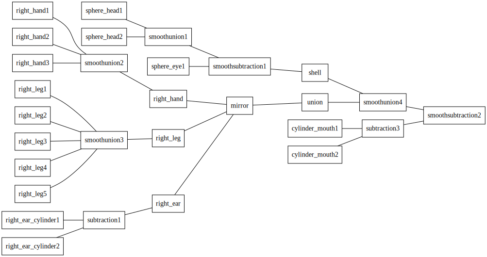

# Volumetric Modelling: Assigment 1

## Modelling Task

Grab an object near you: a coffee cup, a pair of headphones, a drinking bottle, a fan or flower pot. Analyse the parts and identify, what primitives in what combinations it could be made of.
Create the object as a CSG tree made of *primitives*, *combinations* and *modifications* in a jupyter notebook.

The result can also just be "inspired by" a real world object and be the result of your own creative expression. Some inspiration from a previous volumetric modelling course:

## Required Handins

[**jupyter notebook**](MU_mike_volumetric.ipynb)

[**obj file**](MU-mike.obj)

