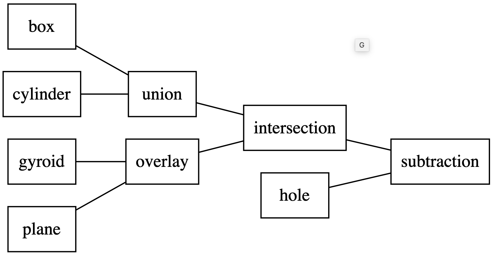

# Volumetric Modelling: Assigment 1

## Modelling Task

Grab an object near you: a coffee cup, a pair of headphones, a drinking bottle, a fan or flower pot. Analyse the parts and identify, what primitives in what combinations it could be made of.
Create the object as a CSG tree made of *primitives*, *combinations* and *modifications* in a jupyter notebook.

The result can also just be "inspired by" a real world object and be the result of your own creative expression. Some inspiration from a previous volumetric modelling course:

## Required Handins

Please upload to github:
- the _jupyter notebook_ with the ipyvolume viewers embedded.
- a _diagram_ like the one below that illustrates the logic of your CSG tree
  - 
  - create it with the drawing tool of your choice or use somethong like [Graphviz](http://bit.ly/33xAcjF) for it
- an _*.obj_ file of the final mesh (using `utilities > export_ipv_mesh()`)
