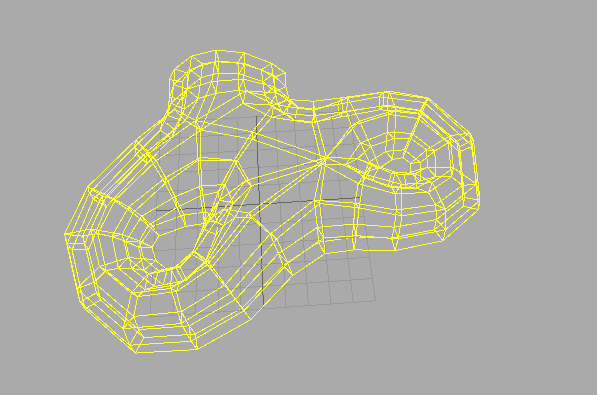
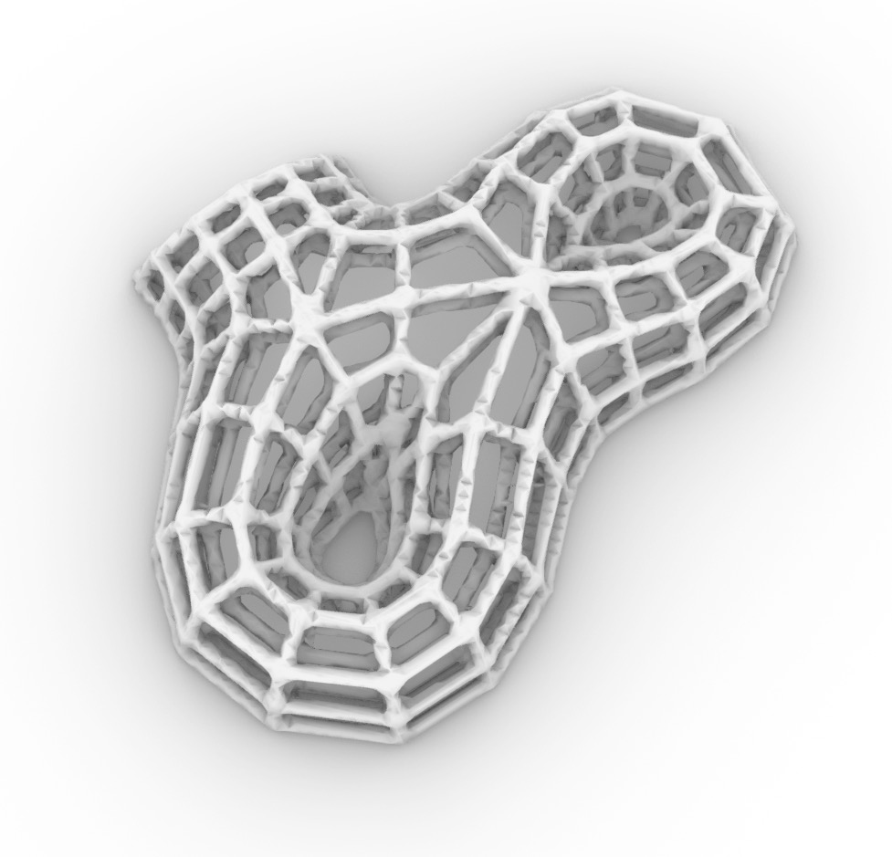

# Volumetric Modelling: Assigment 2

## Modelling Task

Assume a hypothetical or actual space frame structure: an assembly made of nodes and edges. Formulate a design strategy based on assumed or given constraints. Model the geometry of one connector node, using an approach that would generalise for all the nodes in the system, independent of the number and angle of edges.

Choose strategies for reducing the weight of the part or increasing its strength with the same weight respectively. For doing so, employ internal lattice fills, smooth corner blends but also surface patterning, ribs, beads (German: "Sicken"). Use to your advantage that whether or not the node is structurally sound will not factor in the grading.

## Required Hand-ins

[**jupyter notebook**](spaceframe_shell.ipynb)

[**obj file**](space_frame_structure.obj)

 

 

